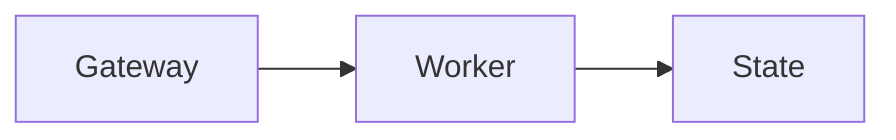

How the transcript renders source previews, tables, and diagrams.

## Source previews and copying code

Select **Open** on a text attachment to read it directly in the **Files** side
panel. Same-origin text attachments, including pasted `.txt` files, Markdown,
CSV, and JSON, display as selectable, read-only text with line breaks and
indentation preserved. HTML and other markup remain literal text, never an
embedded page. Previews require UTF-8 content no larger than 256 KiB; unsupported,
external, oversized, or unavailable files keep their **Download** action.

**View Raw Text** keeps Markdown notation literal, including nested code fences.
Decoded text artifacts use the same literal preview. **Copy code** preserves the
code's leading whitespace and final newline when present. Indented Markdown code
blocks also work at the start of a message and remain literal while streaming,
including blank lines within the block.

**Copy URL** in browser tab cards also works on plain HTTP connections where the
browser does not provide its Clipboard API.

If the browser rejects a text clipboard write, starting another text or image
copy cancels its delayed fallback. Code blocks replaced during streaming and
Mermaid diagrams whose source changes also cancel that fallback. This does not
cancel native clipboard writes that the browser has already accepted.

## Markdown tables

Markdown tables scroll horizontally within the conversation. **Copy table** copies
tab-separated cells, and **Expand table** opens a larger view. In Chat, workspace
file and session links work in either view, including Enter and Space keyboard
activation. Following a link closes the expanded view so you can use its destination.

The **Ask OpenClaw** panel supports table scrolling, copying, expansion, and web
links. Its session links open with a click or Enter. Space does not activate
those links, and workspace-file references do not open a preview.

## Mermaid diagrams

Use a `mermaid` fenced code block in chat. The Control UI renders it as a diagram
automatically:

````markdown

````

Open the **Diagram options** menu in the top-right corner to switch between the
diagram and source or choose **Expand diagram** for the image viewer with zoom.
The copy button appears on hover or keyboard focus and stays visible on touch
screens. It copies the original Mermaid text.
Diagram colors and fonts follow the current UI theme.

An unfinished streaming fence stays readable as code. Rendering starts when the
closing fence arrives or the response finishes. Invalid or overly complex
diagrams keep their source visible with an error; correct the syntax or simplify
the diagram. Diagram source cannot run scripts or click handlers, load external
images, or add custom CSS to the Control UI.

Renderer loading or timeout errors instead suggest reloading the dashboard and
checking proxy authentication. The renderer runs in an isolated frame, so its
`assets/mermaid.min-*.js` and `assets/frame-*.js` requests do not send `SameSite=Lax`
or `SameSite=Strict` cookies. Behind a cookie-authenticated reverse proxy, those
static asset URLs must be reachable without those cookies, including under any
configured `gateway.controlUi.basePath`. Check the browser Network panel for
blocked requests or redirects to a login page. Keep authentication on the
dashboard and Gateway APIs; any proxy exception should cover only these static
renderer assets. Reload after correcting the asset access rules.
