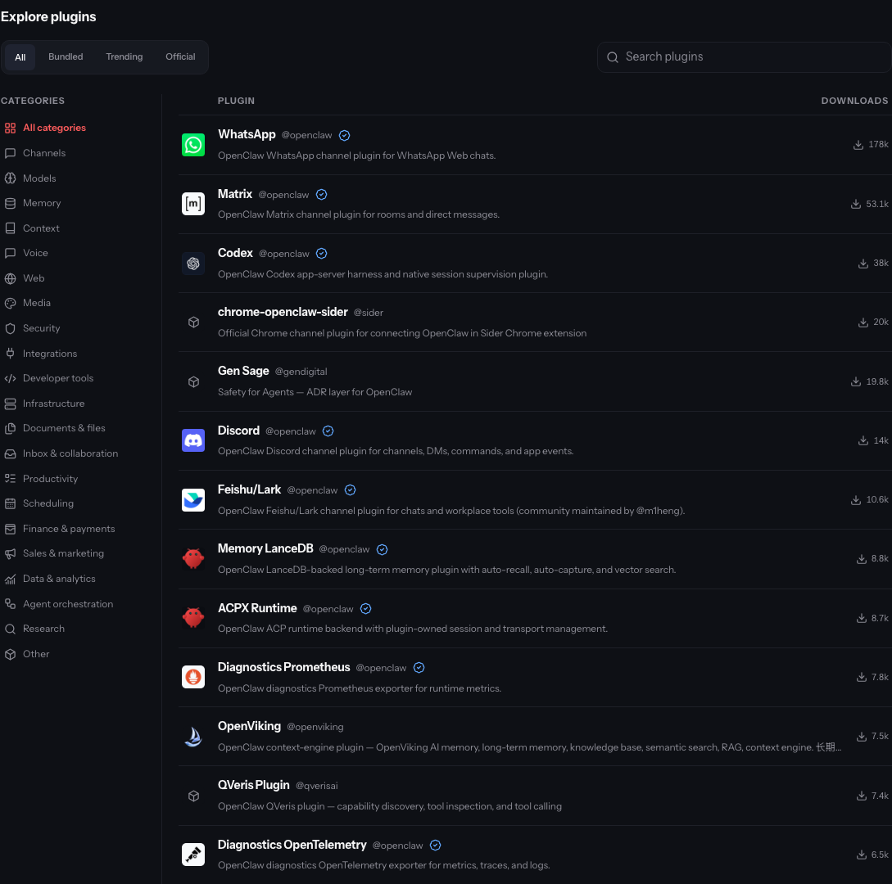
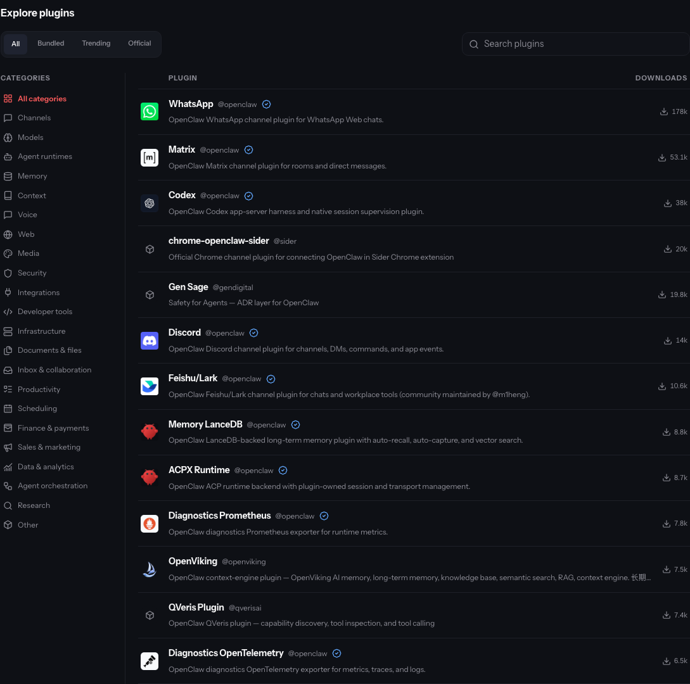
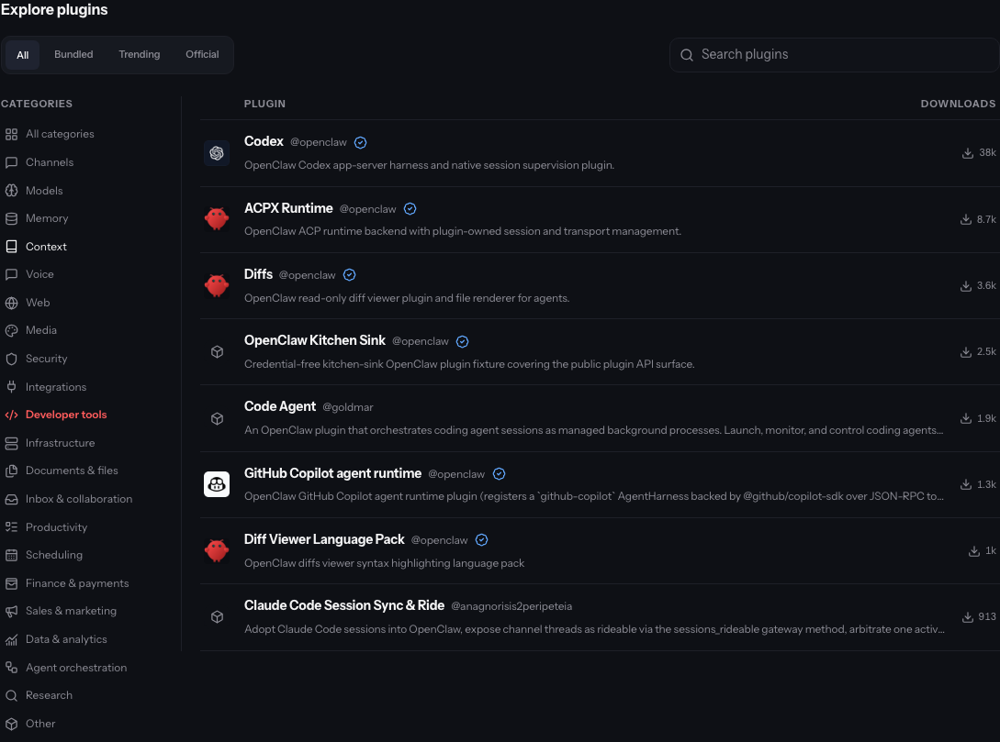
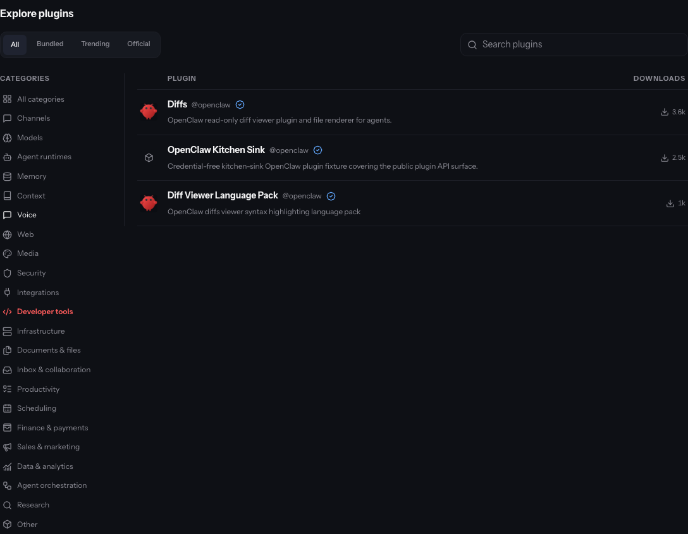
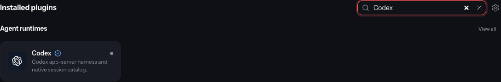
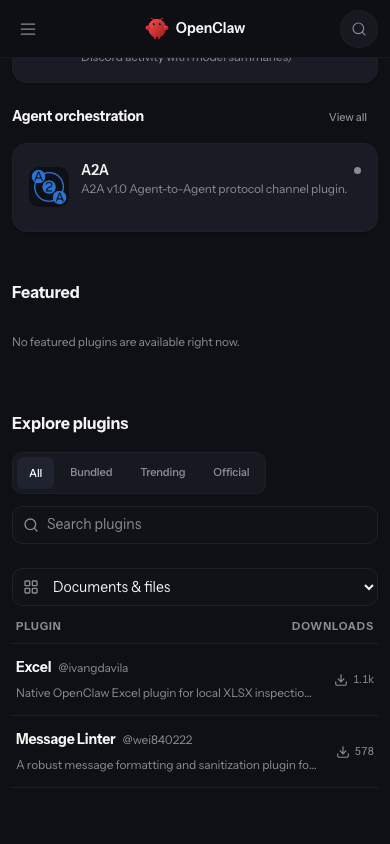
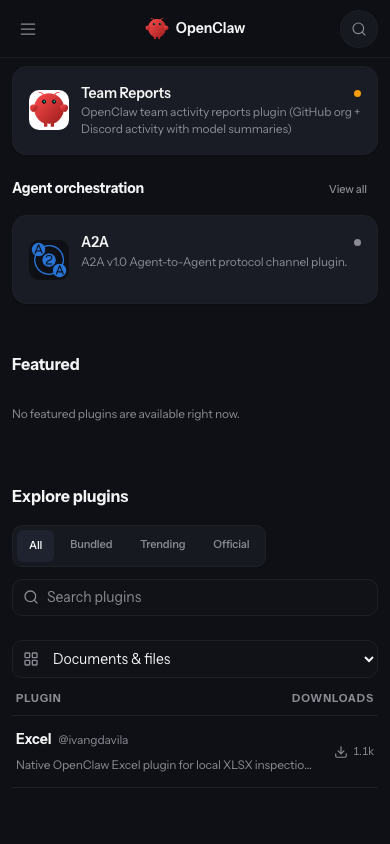
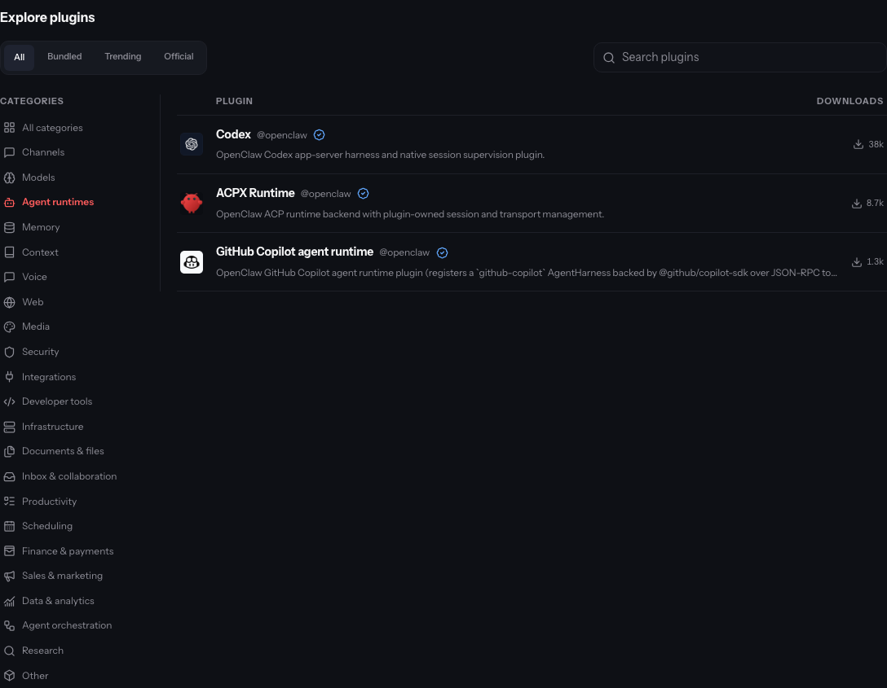
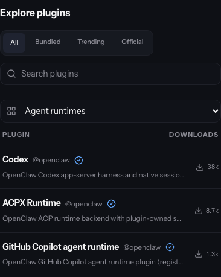

# OpenClaw Agent runtimes proof

Real browser and local backend verification pass. The final local sample contains **93 applied assignments, six held proposals and one missing-evidence skip**. Production is unchanged.

## Scope and evidence

This local rehearsal uses **100 public production plugins, 190 releases, and 365 SHA-256-verified static manifest/documentation files (8.69 MB)** captured between 2026-09-09 02:48:41 and 02:51:29 UTC. It is a per-record logical snapshot, not a globally atomic database export. User profiles in the local fixture are synthetic. Public proof omits database IDs, storage IDs, local filesystem paths, credentials, and private hostnames. Production was read-only; plugin source artifacts were inspected as data and not executed by the classifier.

**59 real `gpt-5.6-luna` classifications succeeded.** Semantic review accepted 53 and held six proposals; **40 source-pinned bundled assignments complete 93 applied latest-release assignments**, of which **73 category values differ from original production metadata**. `gog-extended` has no readable bounded root-manifest evidence and is skipped. The six semantic holds are successful model responses that were not accepted; they are not model transport failures.

The real local Convex migration component processed batches of 10. Dry run and application passed, including **all 22 public category filters, all 100 package/search projections, and all 190 exact-version API responses**. All 90 historical releases and seven unselected latest releases stayed unchanged. Source files, hashes, storage references, scan state, and unrelated metadata stayed unchanged. Rollback restored all 100 package documents, all 190 release documents and their exact-version responses. Replaying the same 93 reviewed assignments required identical evidence hashes and current classifier/inventory identity, made **zero new model calls**, and passed reapplication plus a completed repeat with no changes. This is reviewed-assignment replay, not an independent model run.

## Category contract

The final vocabulary contains **22 categories**. Agent runtimes identifies execution engines that run the agent loop and own native sessions; its icon is Lucide `bot`. Context covers active-context assembly and compaction, Agent orchestration covers coordinating agents, and Developer tools covers software development workflows. This distinguishes runtime purpose from incidental coding or tool capabilities.

New releases declare exactly one category or receive one generated category from the shared publication/refresh classifier. The strict output schema permits one canonical slug; `OPENAI_PLUGIN_CATEGORY_MODEL` is a dedicated override. Explicit author declarations in already-published artifacts remain authoritative, including legacy multi-category declarations. Superseded generated previews cannot be accepted or applied. Failed generation falls back to Other for publication and cannot be accepted for backfill. Skills and historical releases are outside the refresh scope.

The source audit covers **152 bundled manifests, all single-category, and 149 named registry mappings** pinned to OpenClaw `3bf34b0570d3e55ad16f7c4cb25249797a59042b`. Relative to the preceding single-category source revision, only `acpx`, `codex`, and `copilot` move from Developer tools to Agent runtimes; non-category manifest fields remain unchanged. All 152 source rationales and evidence paths are retained in `summary.json`. `active-memory`, `device-pair`, and `talk-voice` have no source package name, so they are excluded from registry matching. Registry metadata updates do not alter archived package artifact bytes.

## Two distinct before states

The **UI baseline** is the preceding 21-category singleton implementation: ClawHub `c84bf8ed75` and OpenClaw `43d9cdff8f4`, with 97 reviewed v2 updates already applied to this same local sample. The UI candidate uses ClawHub `4db8c940aa` and OpenClaw `a06680b77c`, with 22 categories and the 93 reviewed v3 updates.

The **backend migration baseline** is independently restored original production metadata. Its 73 changed category values are measured against that original state; they are not the number of differences between the two UI screenshots. The old v2 assignments were fully rolled back before the fresh v3 model preview.

## Validation and limits

ClawHub: **6,517 unit tests pass (3 skipped)**, type/build and package gates pass, and the focused classifier/refresh/exact-version suite passes 16 cases. OpenClaw: **67 source/category tests and 253 runtime/discovery tests pass**, and runtime/UI builds pass. The tested ClawHub candidate predates the dependency fixes now on main; full static after restacking remains pending. The broader OpenClaw changed-file gate encounters the unchanged expired plugin-SDK compatibility deadline reproduced on baseline.

This 100-plugin rehearsal is not a complete production-catalog preview. Production application still requires a fresh preview under the final definitions, semantic review, dry run, and accepted bounded application. The sample contains no actual explicit category declarations in root manifests, so author precedence and new-publication behavior are demonstrated by publication and refresh tests, not by claiming those cases appeared in this sample.

## Reproduce the local operations

Seed a disposable local Convex backend with the bounded public records and verified static files. Rebuild category/search projections. Run `pluginCategoryRefresh:preview` with a fresh run ID and bounded batch size, continuing returned cursors. Inspect `pluginCategoryRefresh:list`, accept only reviewed IDs, dry-run `migrations:applyAcceptedPluginCategoryRefreshes`, then apply through `migrations:run`. Compare `POST /api/v1/packages/categories:batch` and every `GET /api/v1/plugins?category=...` result against stored metadata. Verify historical/unselected records and artifacts, exercise guarded rollback, and replay reviewed assignments only after revalidating identical evidence, classifier and source inventory. Verify a completed repeat is a no-op.

## Semantic review holds

| Package | Proposed | Retained | Review hold |
| --- | --- | --- | --- |
| hirey | integrations | other | People-matching workflow: the generic Integrations rationale ignores its primary purpose. |
| @vauxr/openclaw | channels | channels, tools, voice | Voice-device bridge remains ambiguous between Voice and Channels. |
| xhs-insights-openclaw-plugin | sales-marketing | other | Read-only social research matches Research like its Douyin sibling; evidence does not establish campaign operations. |
| imclaw | channels | channels, tools, media | Agent-to-agent social messaging conflicts with the human-agent Channels boundary. |
| web-search-plus-plugin-v2 | research | tools, web | Source-only generic search and extraction fits Web; the Research proposal is unsupported. |
| claude-code-sync | agent-runtimes | other | Session discovery, driver locks and relay: README identifies the gateway half and advisory spawn, without an agent execution engine to support Agent runtimes. |

## Real browser comparison

Captured in real Chromium on the agent host after waiting for the exact expected plugin identities, not only result counts. Desktop viewport: 1440×1080; mobile: 390×844. These are actual application screenshots; source pixels were not composed or edited.

Developer tools changes from **8 to 3** results. Three native runtimes move into Agent runtimes; Code Agent separately moves into Agent orchestration, and the held Claude Code Sync proposal retains original production metadata. The new Agent runtimes filter shows **Codex, ACPX and Copilot** with its Bot category icon. New-category desktop/mobile captures are **candidate-only**, since the v2 category list has no matching category.

OpenClaw ran through the real Gateway on local port 21231, inspected via an authenticated browser preview; its private hostname is omitted. Paired captures show category navigation, Developer tools, installed Codex, and mobile Documents & files (2 → 1 results). Installed Codex moves from Developer tools to Agent runtimes; its actual 256×256 icon fully decoded. The source/API comparison verifies all 152 installed bundled entries, all 150 packaged manifests, all 149 source pins and all 100 public registry category matches. All 22 definitions and filters, 15 HTTP route checks, and the served UI asset SHA match the new build.

Capture boundaries:

- Category navigation: Cropped real screenshots at x=304, y=0, width=1089, height=1080. Account sidebar and community invitation excluded; no content modification.
- Developer tools filter: Baseline cropped real screenshot x=304, y=205, width=1089, height=809; candidate captured actual .plugin-catalog-results element. Removes account sidebar/invitation.
- Installed Codex category: Real installed plugin section filtered by Codex; icon decoded and complete on both. Developer tools → Agent runtimes.
- Mobile Documents & files: Same /plugins page and Documents & files filter. Real viewport captures.
- Agent runtimes filter (candidate only): Real catalog element with Agent runtimes selected. New feature; no prior equivalent.
- Mobile Agent runtimes filter (candidate only): Real catalog element at 390 × 844 viewport; selected Agent runtimes.

| Paired state | Before | After |
| --- | --- | --- |
| Category navigation |  |  |
| Developer tools filter |  |  |
| Installed Codex category |  |  |
| Mobile Documents & files |  |  |

New-category captures (candidate only):

## All bundled assignment rationales

| Plugin | Previous category | Final category | Rationale |
| --- | --- | --- | --- |
| [a2a](https://github.com/openclaw/openclaw/blob/3bf34b0570d3e55ad16f7c4cb25249797a59042b/extensions/a2a/openclaw.plugin.json) | agent-orchestration | agent-orchestration | Connects external agents, discovers peers, submits tasks, and exchanges agent responses through Agent2Agent; the participants are agents rather than a human messaging service. |
| [acpx](https://github.com/openclaw/openclaw/blob/3bf34b0570d3e55ad16f7c4cb25249797a59042b/extensions/acpx/openclaw.plugin.json) | developer-tools | agent-runtimes | Provides the ACP runtime backend for executing external agents with plugin-owned sessions, transport management, and session continuation. |
| [active-memory](https://github.com/openclaw/openclaw/blob/3bf34b0570d3e55ad16f7c4cb25249797a59042b/extensions/active-memory/openclaw.plugin.json) | memory | memory | Retrieves durable memory before replies and implements per-agent remembering across conversations. |
| [admin-http-rpc](https://github.com/openclaw/openclaw/blob/3bf34b0570d3e55ad16f7c4cb25249797a59042b/extensions/admin-http-rpc/openclaw.plugin.json) | infrastructure | infrastructure | Exposes selected Gateway administration methods over authenticated HTTP so operators can manage the running service. |
| [alibaba](https://github.com/openclaw/openclaw/blob/3bf34b0570d3e55ad16f7c4cb25249797a59042b/extensions/alibaba/openclaw.plugin.json) | media | media | Generates video through Alibaba Model Studio; the manifest declares video generation rather than general chat inference. |
| [amazon-bedrock](https://github.com/openclaw/openclaw/blob/3bf34b0570d3e55ad16f7c4cb25249797a59042b/extensions/amazon-bedrock/openclaw.plugin.json) | models | models | Connects Amazon Bedrock inference and model discovery; embeddings are an additional capability of the general model provider. |
| [amazon-bedrock-mantle](https://github.com/openclaw/openclaw/blob/3bf34b0570d3e55ad16f7c4cb25249797a59042b/extensions/amazon-bedrock-mantle/openclaw.plugin.json) | models | models | Routes model inference through the Amazon Bedrock Mantle OpenAI-compatible endpoint. |
| [anthropic](https://github.com/openclaw/openclaw/blob/3bf34b0570d3e55ad16f7c4cb25249797a59042b/extensions/anthropic/openclaw.plugin.json) | models | models | Primarily supplies Anthropic model access; its Claude CLI backend and native session catalog are secondary surfaces, so the one-purpose choice remains Models. |
| [anthropic-vertex](https://github.com/openclaw/openclaw/blob/3bf34b0570d3e55ad16f7c4cb25249797a59042b/extensions/anthropic-vertex/openclaw.plugin.json) | models | models | Makes Claude inference available through Google Vertex AI. |
| [arcee](https://github.com/openclaw/openclaw/blob/3bf34b0570d3e55ad16f7c4cb25249797a59042b/extensions/arcee/openclaw.plugin.json) | models | models | Adds the Arcee inference provider and discovers its available models. |
| [azure-speech](https://github.com/openclaw/openclaw/blob/3bf34b0570d3e55ad16f7c4cb25249797a59042b/extensions/azure-speech/openclaw.plugin.json) | voice | voice | Synthesizes speech through Azure AI Speech for voice notes and telephony. |
| [baseten](https://github.com/openclaw/openclaw/blob/3bf34b0570d3e55ad16f7c4cb25249797a59042b/extensions/baseten/openclaw.plugin.json) | models | models | Adds Baseten inference endpoints and its model catalog. |
| [beam](https://github.com/openclaw/openclaw/blob/3bf34b0570d3e55ad16f7c4cb25249797a59042b/extensions/beam/openclaw.plugin.json) | developer-tools | developer-tools | Receives, reads, mirrors, archives, and copies redacted coding-session snapshots for review or continuation. It does not supply an agent executor or session execution lifecycle. |
| [bonjour](https://github.com/openclaw/openclaw/blob/3bf34b0570d3e55ad16f7c4cb25249797a59042b/extensions/bonjour/openclaw.plugin.json) | infrastructure | infrastructure | Advertises the local Gateway with Bonjour/mDNS so clients can discover the running service. |
| [brave](https://github.com/openclaw/openclaw/blob/3bf34b0570d3e55ad16f7c4cb25249797a59042b/extensions/brave/openclaw.plugin.json) | web | web | Provides general web search through Brave Search. |
| [browser](https://github.com/openclaw/openclaw/blob/3bf34b0570d3e55ad16f7c4cb25249797a59042b/extensions/browser/openclaw.plugin.json) | web | web | Provides general browser control for navigating and interacting with websites. |
| [buzz](https://github.com/openclaw/openclaw/blob/3bf34b0570d3e55ad16f7c4cb25249797a59042b/extensions/buzz/openclaw.plugin.json) | channels | channels | Connects people in Buzz team rooms to OpenClaw agents, preserving room and thread replies. |
| [byteplus](https://github.com/openclaw/openclaw/blob/3bf34b0570d3e55ad16f7c4cb25249797a59042b/extensions/byteplus/openclaw.plugin.json) | models | models | Adds BytePlus general model inference and catalog selection, with video generation as an additional capability. |
| [canvas](https://github.com/openclaw/openclaw/blob/3bf34b0570d3e55ad16f7c4cb25249797a59042b/extensions/canvas/openclaw.plugin.json) | documents-files | documents-files | Presents hosted widget documents in a render-only macOS panel and provides document rendering for A2UI boards; it does not manage tasks or create image/video media. |
| [cerebras](https://github.com/openclaw/openclaw/blob/3bf34b0570d3e55ad16f7c4cb25249797a59042b/extensions/cerebras/openclaw.plugin.json) | models | models | Adds the Cerebras general inference provider and model catalog. |
| [chutes](https://github.com/openclaw/openclaw/blob/3bf34b0570d3e55ad16f7c4cb25249797a59042b/extensions/chutes/openclaw.plugin.json) | models | models | Adds Chutes general inference routing and model configuration. |
| [clawrouter](https://github.com/openclaw/openclaw/blob/3bf34b0570d3e55ad16f7c4cb25249797a59042b/extensions/clawrouter/openclaw.plugin.json) | models | models | Routes inference across model providers and reports quota usage. |
| [clickclack](https://github.com/openclaw/openclaw/blob/3bf34b0570d3e55ad16f7c4cb25249797a59042b/extensions/clickclack/openclaw.plugin.json) | channels | channels | Lets an OpenClaw agent participate as a bot user in a ClickClack workspace; discussion tools support that transport. |
| [cloudflare-ai-gateway](https://github.com/openclaw/openclaw/blob/3bf34b0570d3e55ad16f7c4cb25249797a59042b/extensions/cloudflare-ai-gateway/openclaw.plugin.json) | models | models | Connects model inference through Cloudflare AI Gateway; its product purpose is model routing. |
| [codex](https://github.com/openclaw/openclaw/blob/3bf34b0570d3e55ad16f7c4cb25249797a59042b/extensions/codex/openclaw.plugin.json) | developer-tools | agent-runtimes | Provides the Codex app-server agent executor, native agent turns, and session lifecycle. Coding is a supported workload; supplying the runtime is the plugin main purpose. |
| [cohere](https://github.com/openclaw/openclaw/blob/3bf34b0570d3e55ad16f7c4cb25249797a59042b/extensions/cohere/openclaw.plugin.json) | models | models | Adds Cohere general inference and model catalog selection. |
| [comfy](https://github.com/openclaw/openclaw/blob/3bf34b0570d3e55ad16f7c4cb25249797a59042b/extensions/comfy/openclaw.plugin.json) | media | media | Runs ComfyUI image, music, and video generation workflows; its provider identity does not represent general chat inference. |
| [copilot](https://github.com/openclaw/openclaw/blob/3bf34b0570d3e55ad16f7c4cb25249797a59042b/extensions/copilot/openclaw.plugin.json) | developer-tools | agent-runtimes | Provides the GitHub Copilot agent executor, native tool loop, compaction, and persistent session lifecycle, distinct from the separate GitHub Copilot model provider. |
| [copilot-proxy](https://github.com/openclaw/openclaw/blob/3bf34b0570d3e55ad16f7c4cb25249797a59042b/extensions/copilot-proxy/openclaw.plugin.json) | models | models | Makes models exposed by Copilot Proxy available as an inference provider; it does not implement a coding harness. |
| [crabbox](https://github.com/openclaw/openclaw/blob/3bf34b0570d3e55ad16f7c4cb25249797a59042b/extensions/crabbox/openclaw.plugin.json) | infrastructure | infrastructure | Supplies cloud worker hosting through the Crabbox CLI; provisioning compute is its purpose, rather than supplying the agent executor itself. |
| [cua-computer](https://github.com/openclaw/openclaw/blob/3bf34b0570d3e55ad16f7c4cb25249797a59042b/extensions/cua-computer/openclaw.plugin.json) | infrastructure | infrastructure | Provides the native desktop execution and control backend for paired nodes and cloud sessions, including screen observation, application control, and driver execution lifecycle. |
| [deepgram](https://github.com/openclaw/openclaw/blob/3bf34b0570d3e55ad16f7c4cb25249797a59042b/extensions/deepgram/openclaw.plugin.json) | voice | voice | Transcribes audio and provides realtime transcription; its media-understanding implementation is audio-only. |
| [deepinfra](https://github.com/openclaw/openclaw/blob/3bf34b0570d3e55ad16f7c4cb25249797a59042b/extensions/deepinfra/openclaw.plugin.json) | models | models | Adds DeepInfra general model inference and catalog configuration, alongside optional media, embeddings, and speech capabilities. |
| [deepseek](https://github.com/openclaw/openclaw/blob/3bf34b0570d3e55ad16f7c4cb25249797a59042b/extensions/deepseek/openclaw.plugin.json) | models | models | Adds DeepSeek inference, model selection, and usage reporting. |
| [device-pair](https://github.com/openclaw/openclaw/blob/3bf34b0570d3e55ad16f7c4cb25249797a59042b/extensions/device-pair/openclaw.plugin.json) | security | security | Issues setup codes and approves device pairing, controlling which devices receive trusted access. |
| [diagnostics-otel](https://github.com/openclaw/openclaw/blob/3bf34b0570d3e55ad16f7c4cb25249797a59042b/extensions/diagnostics-otel/openclaw.plugin.json) | infrastructure | infrastructure | Exports runtime metrics, traces, and logs through OpenTelemetry for service monitoring. |
| [diagnostics-prometheus](https://github.com/openclaw/openclaw/blob/3bf34b0570d3e55ad16f7c4cb25249797a59042b/extensions/diagnostics-prometheus/openclaw.plugin.json) | infrastructure | infrastructure | Exports runtime metrics for Prometheus service monitoring. |
| [diffs](https://github.com/openclaw/openclaw/blob/3bf34b0570d3e55ad16f7c4cb25249797a59042b/extensions/diffs/openclaw.plugin.json) | developer-tools | developer-tools | Renders source diffs and files for review; image and PDF output formats serve the code-review workflow. |
| [diffs-language-pack](https://github.com/openclaw/openclaw/blob/3bf34b0570d3e55ad16f7c4cb25249797a59042b/extensions/diffs-language-pack/openclaw.plugin.json) | developer-tools | developer-tools | Adds syntax highlighting languages to the software diff-review viewer. |
| [discord](https://github.com/openclaw/openclaw/blob/3bf34b0570d3e55ad16f7c4cb25249797a59042b/extensions/discord/openclaw.plugin.json) | channels | channels | Lets people talk to an agent in Discord channels and direct messages. |
| [document-extract](https://github.com/openclaw/openclaw/blob/3bf34b0570d3e55ad16f7c4cb25249797a59042b/extensions/document-extract/openclaw.plugin.json) | documents-files | documents-files | Extracts text or fallback page images from PDF document attachments; it processes documents rather than selecting active conversation context. |
| [duckduckgo](https://github.com/openclaw/openclaw/blob/3bf34b0570d3e55ad16f7c4cb25249797a59042b/extensions/duckduckgo/openclaw.plugin.json) | web | web | Provides general web search through DuckDuckGo. |
| [elevenlabs](https://github.com/openclaw/openclaw/blob/3bf34b0570d3e55ad16f7c4cb25249797a59042b/extensions/elevenlabs/openclaw.plugin.json) | voice | voice | Provides speech synthesis, audio transcription, and realtime transcription through ElevenLabs. |
| [exa](https://github.com/openclaw/openclaw/blob/3bf34b0570d3e55ad16f7c4cb25249797a59042b/extensions/exa/openclaw.plugin.json) | web | web | Provides general web search through Exa. |
| [fal](https://github.com/openclaw/openclaw/blob/3bf34b0570d3e55ad16f7c4cb25249797a59042b/extensions/fal/openclaw.plugin.json) | media | media | Generates images, music, and video through fal; its declared providers specialize in media. |
| [featherless](https://github.com/openclaw/openclaw/blob/3bf34b0570d3e55ad16f7c4cb25249797a59042b/extensions/featherless/openclaw.plugin.json) | models | models | Connects Featherless AI general inference and its model catalog. |
| [feishu](https://github.com/openclaw/openclaw/blob/3bf34b0570d3e55ad16f7c4cb25249797a59042b/extensions/feishu/openclaw.plugin.json) | channels | channels | Connects Feishu/Lark chats to an agent; workplace document and tool capabilities accompany the primary messaging adapter. |
| [file-transfer](https://github.com/openclaw/openclaw/blob/3bf34b0570d3e55ad16f7c4cb25249797a59042b/extensions/file-transfer/openclaw.plugin.json) | documents-files | documents-files | Lists, fetches, and writes files on paired nodes, including binary transfers. |
| [firecrawl](https://github.com/openclaw/openclaw/blob/3bf34b0570d3e55ad16f7c4cb25249797a59042b/extensions/firecrawl/openclaw.plugin.json) | web | web | Searches and extracts web pages through Firecrawl; tool exposure serves general web access. |
| [fireworks](https://github.com/openclaw/openclaw/blob/3bf34b0570d3e55ad16f7c4cb25249797a59042b/extensions/fireworks/openclaw.plugin.json) | models | models | Connects Fireworks model inference and catalog selection. |
| [fish-audio-speech](https://github.com/openclaw/openclaw/blob/3bf34b0570d3e55ad16f7c4cb25249797a59042b/extensions/fish-audio-speech/openclaw.plugin.json) | voice | voice | Synthesizes streaming speech for voice notes and telephony through Fish Audio. |
| [geolocation](https://github.com/openclaw/openclaw/blob/3bf34b0570d3e55ad16f7c4cb25249797a59042b/extensions/geolocation/openclaw.plugin.json) | infrastructure | infrastructure | Adds city information to connecting client IP addresses for Gateway operational surfaces. |
| [github-copilot](https://github.com/openclaw/openclaw/blob/3bf34b0570d3e55ad16f7c4cb25249797a59042b/extensions/github-copilot/openclaw.plugin.json) | models | models | Supplies GitHub Copilot model access; the separate copilot plugin owns the agent runtime. |
| [gmi](https://github.com/openclaw/openclaw/blob/3bf34b0570d3e55ad16f7c4cb25249797a59042b/extensions/gmi/openclaw.plugin.json) | models | models | Adds GMI Cloud general model inference and endpoint configuration. |
| [google](https://github.com/openclaw/openclaw/blob/3bf34b0570d3e55ad16f7c4cb25249797a59042b/extensions/google/openclaw.plugin.json) | models | models | Primarily supplies Google model access; its Gemini CLI backend is a secondary surface, so the one-purpose choice remains Models. |
| [google-meet](https://github.com/openclaw/openclaw/blob/3bf34b0570d3e55ad16f7c4cb25249797a59042b/extensions/google-meet/openclaw.plugin.json) | voice | voice | Joins calls for spoken interaction: transcribes speech to the agent, speaks replies, or participates with realtime voice. |
| [googlechat](https://github.com/openclaw/openclaw/blob/3bf34b0570d3e55ad16f7c4cb25249797a59042b/extensions/googlechat/openclaw.plugin.json) | channels | channels | Connects Google Chat spaces and direct messages to the agent. |
| [gradium](https://github.com/openclaw/openclaw/blob/3bf34b0570d3e55ad16f7c4cb25249797a59042b/extensions/gradium/openclaw.plugin.json) | voice | voice | Provides speech synthesis through Gradium. |
| [groq](https://github.com/openclaw/openclaw/blob/3bf34b0570d3e55ad16f7c4cb25249797a59042b/extensions/groq/openclaw.plugin.json) | models | models | Provides the Groq chat inference catalog as well as transcription; the complete manifest includes general model inference, not just its narrow package description. |
| [huggingface](https://github.com/openclaw/openclaw/blob/3bf34b0570d3e55ad16f7c4cb25249797a59042b/extensions/huggingface/openclaw.plugin.json) | models | models | Routes general model inference through Hugging Face and publishes model choices. |
| [imap](https://github.com/openclaw/openclaw/blob/3bf34b0570d3e55ad16f7c4cb25249797a59042b/extensions/imap/openclaw.plugin.json) | inbox-collaboration | inbox-collaboration | Watches incoming mailboxes and dispatches authenticated email for agent processing; it is an inbox trigger rather than a conversational channel adapter. |
| [imessage](https://github.com/openclaw/openclaw/blob/3bf34b0570d3e55ad16f7c4cb25249797a59042b/extensions/imessage/openclaw.plugin.json) | channels | channels | Connects iMessage conversations on a signed-in Mac to the agent. |
| [inworld](https://github.com/openclaw/openclaw/blob/3bf34b0570d3e55ad16f7c4cb25249797a59042b/extensions/inworld/openclaw.plugin.json) | voice | voice | Synthesizes streaming speech through Inworld for voice notes and telephony. |
| [irc](https://github.com/openclaw/openclaw/blob/3bf34b0570d3e55ad16f7c4cb25249797a59042b/extensions/irc/openclaw.plugin.json) | channels | channels | Connects IRC conversations to the agent. |
| [kilocode](https://github.com/openclaw/openclaw/blob/3bf34b0570d3e55ad16f7c4cb25249797a59042b/extensions/kilocode/openclaw.plugin.json) | models | models | Adds Kilo Gateway model routing and catalog selection; it does not expose a coding-agent harness. |
| [kimi](https://github.com/openclaw/openclaw/blob/3bf34b0570d3e55ad16f7c4cb25249797a59042b/extensions/kimi-coding/openclaw.plugin.json) | models | models | Adds the Kimi inference provider and model catalog; coding-plan branding does not make this a code-editing tool. |
| [line](https://github.com/openclaw/openclaw/blob/3bf34b0570d3e55ad16f7c4cb25249797a59042b/extensions/line/openclaw.plugin.json) | channels | channels | Connects LINE Bot API conversations to the agent. |
| [linux-node](https://github.com/openclaw/openclaw/blob/3bf34b0570d3e55ad16f7c4cb25249797a59042b/extensions/linux-node/openclaw.plugin.json) | infrastructure | infrastructure | Adds operating-system capabilities to Linux node hosts, including notifications, camera commands, and location. |
| [litellm](https://github.com/openclaw/openclaw/blob/3bf34b0570d3e55ad16f7c4cb25249797a59042b/extensions/litellm/openclaw.plugin.json) | models | models | Connects model inference through LiteLLM and discovers models; image generation is an additional capability. |
| [llama-cpp](https://github.com/openclaw/openclaw/blob/3bf34b0570d3e55ad16f7c4cb25249797a59042b/extensions/llama-cpp/openclaw.plugin.json) | models | models | Provides local or external llama.cpp model inference and discovery, with embeddings as an additional capability. |
| [llm-task](https://github.com/openclaw/openclaw/blob/3bf34b0570d3e55ad16f7c4cb25249797a59042b/extensions/llm-task/openclaw.plugin.json) | agent-orchestration | agent-orchestration | Runs bounded structured LLM steps inside workflows; it contributes workflow orchestration rather than a general agent executor and session lifecycle. |
| [lmstudio](https://github.com/openclaw/openclaw/blob/3bf34b0570d3e55ad16f7c4cb25249797a59042b/extensions/lmstudio/openclaw.plugin.json) | models | models | Provides model inference and discovery for LM Studio, with embeddings as an additional capability. |
| [lobster](https://github.com/openclaw/openclaw/blob/3bf34b0570d3e55ad16f7c4cb25249797a59042b/extensions/lobster/openclaw.plugin.json) | agent-orchestration | agent-orchestration | Runs typed workflow pipelines with resumable approvals; coordinating workflow steps is its purpose rather than supplying an agent executor. |
| [logbook](https://github.com/openclaw/openclaw/blob/3bf34b0570d3e55ad16f7c4cb25249797a59042b/extensions/logbook/openclaw.plugin.json) | productivity | productivity | Builds a reviewable work journal and daily timeline from periodic screen snapshots. |
| [longcat](https://github.com/openclaw/openclaw/blob/3bf34b0570d3e55ad16f7c4cb25249797a59042b/extensions/longcat/openclaw.plugin.json) | models | models | Adds LongCat general model inference and catalog configuration. |
| [matrix](https://github.com/openclaw/openclaw/blob/3bf34b0570d3e55ad16f7c4cb25249797a59042b/extensions/matrix/openclaw.plugin.json) | channels | channels | Connects Matrix rooms and direct messages to the agent. |
| [mattermost](https://github.com/openclaw/openclaw/blob/3bf34b0570d3e55ad16f7c4cb25249797a59042b/extensions/mattermost/openclaw.plugin.json) | channels | channels | Connects Mattermost chat conversations to the agent. |
| [memory-core](https://github.com/openclaw/openclaw/blob/3bf34b0570d3e55ad16f7c4cb25249797a59042b/extensions/memory-core/openclaw.plugin.json) | memory | memory | Provides durable agent memory search and retrieval across conversations. |
| [memory-lancedb](https://github.com/openclaw/openclaw/blob/3bf34b0570d3e55ad16f7c4cb25249797a59042b/extensions/memory-lancedb/openclaw.plugin.json) | memory | memory | Stores and retrieves long-term agent memory using auto-capture, auto-recall, and vector search. |
| [memory-wiki](https://github.com/openclaw/openclaw/blob/3bf34b0570d3e55ad16f7c4cb25249797a59042b/extensions/memory-wiki/openclaw.plugin.json) | memory | memory | Compiles durable knowledge into a searchable wiki vault with provenance and optional shared memory recall. |
| [meta](https://github.com/openclaw/openclaw/blob/3bf34b0570d3e55ad16f7c4cb25249797a59042b/extensions/meta/openclaw.plugin.json) | models | models | Adds Meta model inference and catalog configuration. |
| [microsoft](https://github.com/openclaw/openclaw/blob/3bf34b0570d3e55ad16f7c4cb25249797a59042b/extensions/microsoft/openclaw.plugin.json) | voice | voice | Provides Microsoft/Edge text-to-speech; it is a speech provider rather than general model inference. |
| [microsoft-foundry](https://github.com/openclaw/openclaw/blob/3bf34b0570d3e55ad16f7c4cb25249797a59042b/extensions/microsoft-foundry/openclaw.plugin.json) | models | models | Connects inference through Microsoft Foundry; image generation is an additional capability of the provider. |
| [migrate-claude](https://github.com/openclaw/openclaw/blob/3bf34b0570d3e55ad16f7c4cb25249797a59042b/extensions/migrate-claude/openclaw.plugin.json) | integrations | integrations | Imports Claude assistant state, instructions, MCP settings, skills, and memory into OpenClaw; its purpose is service migration rather than writing software. |
| [migrate-hermes](https://github.com/openclaw/openclaw/blob/3bf34b0570d3e55ad16f7c4cb25249797a59042b/extensions/migrate-hermes/openclaw.plugin.json) | integrations | integrations | Imports Hermes assistant settings, skills, memory, and supported credentials into OpenClaw. |
| [minimax](https://github.com/openclaw/openclaw/blob/3bf34b0570d3e55ad16f7c4cb25249797a59042b/extensions/minimax/openclaw.plugin.json) | models | models | Adds MiniMax model inference and authentication, alongside additional speech, search, image, music, and video capabilities. |
| [mistral](https://github.com/openclaw/openclaw/blob/3bf34b0570d3e55ad16f7c4cb25249797a59042b/extensions/mistral/openclaw.plugin.json) | models | models | Adds Mistral model inference and catalog selection, alongside embeddings and transcription. |
| [moonshot](https://github.com/openclaw/openclaw/blob/3bf34b0570d3e55ad16f7c4cb25249797a59042b/extensions/moonshot/openclaw.plugin.json) | models | models | Adds Moonshot model inference and model selection, with Kimi web search as an additional capability. |
| [msteams](https://github.com/openclaw/openclaw/blob/3bf34b0570d3e55ad16f7c4cb25249797a59042b/extensions/msteams/openclaw.plugin.json) | channels | channels | Connects Microsoft Teams bot conversations to the agent; this is distinct from the live meeting participant plugin. |
| [mxc](https://github.com/openclaw/openclaw/blob/3bf34b0570d3e55ad16f7c4cb25249797a59042b/extensions/mxc/openclaw.plugin.json) | security | security | Enforces operating-system sandbox isolation and configured execution policy for tools. |
| [nextcloud-talk](https://github.com/openclaw/openclaw/blob/3bf34b0570d3e55ad16f7c4cb25249797a59042b/extensions/nextcloud-talk/openclaw.plugin.json) | channels | channels | Connects Nextcloud Talk conversations to the agent. |
| [nostr](https://github.com/openclaw/openclaw/blob/3bf34b0570d3e55ad16f7c4cb25249797a59042b/extensions/nostr/openclaw.plugin.json) | channels | channels | Connects Nostr encrypted direct messages to the agent. |
| [novita](https://github.com/openclaw/openclaw/blob/3bf34b0570d3e55ad16f7c4cb25249797a59042b/extensions/novita/openclaw.plugin.json) | models | models | Adds Novita model inference and catalog selection across its provider aliases. |
| [nvidia](https://github.com/openclaw/openclaw/blob/3bf34b0570d3e55ad16f7c4cb25249797a59042b/extensions/nvidia/openclaw.plugin.json) | models | models | Adds NVIDIA-hosted inference endpoints and model catalog selection. |
| [oc-path](https://github.com/openclaw/openclaw/blob/3bf34b0570d3e55ad16f7c4cb25249797a59042b/extensions/oc-path/openclaw.plugin.json) | documents-files | documents-files | Inspects, addresses, and edits narrow portions of Markdown, JSONC, JSONL, and YAML workspace files while preserving file structure. |
| [ollama](https://github.com/openclaw/openclaw/blob/3bf34b0570d3e55ad16f7c4cb25249797a59042b/extensions/ollama/openclaw.plugin.json) | models | models | Provides local and cloud Ollama inference; embeddings and web search are additional capabilities. |
| [onepassword](https://github.com/openclaw/openclaw/blob/3bf34b0570d3e55ad16f7c4cb25249797a59042b/extensions/onepassword/openclaw.plugin.json) | security | security | Resolves secrets and brokers access under approval policy with an audit trail. |
| [openai](https://github.com/openclaw/openclaw/blob/3bf34b0570d3e55ad16f7c4cb25249797a59042b/extensions/openai/openclaw.plugin.json) | models | models | Provides OpenAI model inference and model selection, alongside speech, embeddings, image, video, and transcription capabilities. |
| [opencode](https://github.com/openclaw/openclaw/blob/3bf34b0570d3e55ad16f7c4cb25249797a59042b/extensions/opencode/openclaw.plugin.json) | models | models | Primarily supplies OpenCode Zen model access; its native session catalog and ACP continuation are secondary surfaces, so the one-purpose choice remains Models. |
| [opencode-go](https://github.com/openclaw/openclaw/blob/3bf34b0570d3e55ad16f7c4cb25249797a59042b/extensions/opencode-go/openclaw.plugin.json) | models | models | Exposes OpenCode Go inference endpoints and model catalog; it is a model provider rather than a coding harness. |
| [openrouter](https://github.com/openclaw/openclaw/blob/3bf34b0570d3e55ad16f7c4cb25249797a59042b/extensions/openrouter/openclaw.plugin.json) | models | models | Routes model inference through OpenRouter, alongside optional media and speech capabilities. |
| [openshell](https://github.com/openclaw/openclaw/blob/3bf34b0570d3e55ad16f7c4cb25249797a59042b/extensions/openshell/openclaw.plugin.json) | security | security | Runs tools inside an isolated OpenShell sandbox; workspace mirroring and SSH support the execution boundary. |
| [parallel](https://github.com/openclaw/openclaw/blob/3bf34b0570d3e55ad16f7c4cb25249797a59042b/extensions/parallel/openclaw.plugin.json) | web | web | Provides general web search through Parallel. |
| [perplexity](https://github.com/openclaw/openclaw/blob/3bf34b0570d3e55ad16f7c4cb25249797a59042b/extensions/perplexity/openclaw.plugin.json) | web | web | Provides general web search through Perplexity. |
| [pixverse](https://github.com/openclaw/openclaw/blob/3bf34b0570d3e55ad16f7c4cb25249797a59042b/extensions/pixverse/openclaw.plugin.json) | media | media | Generates videos through PixVerse. |
| [policy](https://github.com/openclaw/openclaw/blob/3bf34b0570d3e55ad16f7c4cb25249797a59042b/extensions/policy/openclaw.plugin.json) | security | security | Checks workspace policy requirements and emits conformance audit evidence. |
| [qa-channel](https://github.com/openclaw/openclaw/blob/3bf34b0570d3e55ad16f7c4cb25249797a59042b/extensions/qa-channel/openclaw.plugin.json) | developer-tools | developer-tools | Provides a synthetic channel for software QA scenarios rather than a messaging service for end users. |
| [qa-lab](https://github.com/openclaw/openclaw/blob/3bf34b0570d3e55ad16f7c4cb25249797a59042b/extensions/qa-lab/openclaw.plugin.json) | developer-tools | developer-tools | Provides a debugger UI and scenario runner for testing OpenClaw behavior. |
| [qianfan](https://github.com/openclaw/openclaw/blob/3bf34b0570d3e55ad16f7c4cb25249797a59042b/extensions/qianfan/openclaw.plugin.json) | models | models | Adds Baidu Qianfan general inference endpoints and model selection. |
| [qwen](https://github.com/openclaw/openclaw/blob/3bf34b0570d3e55ad16f7c4cb25249797a59042b/extensions/qwen/openclaw.plugin.json) | models | models | Adds Qwen and related plan inference providers; video and media understanding are additional capabilities. |
| [raft](https://github.com/openclaw/openclaw/blob/3bf34b0570d3e55ad16f7c4cb25249797a59042b/extensions/raft/openclaw.plugin.json) | channels | channels | Lets people message a Raft External Agent through workspace direct chat, with CLI wake notifications and replies. |
| [reef](https://github.com/openclaw/openclaw/blob/3bf34b0570d3e55ad16f7c4cb25249797a59042b/extensions/reef/openclaw.plugin.json) | agent-orchestration | agent-orchestration | Enables guarded agent-to-agent communication across owners so one OpenClaw can coordinate with another. |
| [runway](https://github.com/openclaw/openclaw/blob/3bf34b0570d3e55ad16f7c4cb25249797a59042b/extensions/runway/openclaw.plugin.json) | media | media | Generates video through Runway. |
| [searxng](https://github.com/openclaw/openclaw/blob/3bf34b0570d3e55ad16f7c4cb25249797a59042b/extensions/searxng/openclaw.plugin.json) | web | web | Provides general web search through SearXNG. |
| [senseaudio](https://github.com/openclaw/openclaw/blob/3bf34b0570d3e55ad16f7c4cb25249797a59042b/extensions/senseaudio/openclaw.plugin.json) | voice | voice | Transcribes spoken audio; the media-understanding provider explicitly supports audio only. |
| [sglang](https://github.com/openclaw/openclaw/blob/3bf34b0570d3e55ad16f7c4cb25249797a59042b/extensions/sglang/openclaw.plugin.json) | models | models | Provides inference and model discovery for SGLang-hosted models. |
| [signal](https://github.com/openclaw/openclaw/blob/3bf34b0570d3e55ad16f7c4cb25249797a59042b/extensions/signal/openclaw.plugin.json) | channels | channels | Connects Signal messaging conversations to the agent. |
| [slack](https://github.com/openclaw/openclaw/blob/3bf34b0570d3e55ad16f7c4cb25249797a59042b/extensions/slack/openclaw.plugin.json) | channels | channels | Connects Slack channels, direct messages, and commands to the agent. |
| [sms](https://github.com/openclaw/openclaw/blob/3bf34b0570d3e55ad16f7c4cb25249797a59042b/extensions/sms/openclaw.plugin.json) | channels | channels | Connects human SMS/MMS conversations through Twilio to the agent. |
| [stepfun](https://github.com/openclaw/openclaw/blob/3bf34b0570d3e55ad16f7c4cb25249797a59042b/extensions/stepfun/openclaw.plugin.json) | models | models | Adds StepFun and StepFun plan inference providers and model selection. |
| [synology-chat](https://github.com/openclaw/openclaw/blob/3bf34b0570d3e55ad16f7c4cb25249797a59042b/extensions/synology-chat/openclaw.plugin.json) | channels | channels | Connects Synology Chat channels and direct messages to the agent. |
| [synthetic](https://github.com/openclaw/openclaw/blob/3bf34b0570d3e55ad16f7c4cb25249797a59042b/extensions/synthetic/openclaw.plugin.json) | models | models | Adds Synthetic inference provider authentication and refreshable model discovery. |
| [talk-voice](https://github.com/openclaw/openclaw/blob/3bf34b0570d3e55ad16f7c4cb25249797a59042b/extensions/talk-voice/openclaw.plugin.json) | voice | voice | Lists and selects the voice used for spoken interaction. |
| [tavily](https://github.com/openclaw/openclaw/blob/3bf34b0570d3e55ad16f7c4cb25249797a59042b/extensions/tavily/openclaw.plugin.json) | web | web | Provides general web search and page extraction through Tavily. |
| [team-reports](https://github.com/openclaw/openclaw/blob/3bf34b0570d3e55ad16f7c4cb25249797a59042b/extensions/team-reports/openclaw.plugin.json) | data-analytics | data-analytics | Collects GitHub and Discord activity into periodic team reports and model-written summaries. |
| [teams-meetings](https://github.com/openclaw/openclaw/blob/3bf34b0570d3e55ad16f7c4cb25249797a59042b/extensions/teams-meetings/openclaw.plugin.json) | voice | voice | Joins Teams calls to listen, transcribe, and speak using shared agent, realtime-voice, and transcription participation modes. |
| [telegram](https://github.com/openclaw/openclaw/blob/3bf34b0570d3e55ad16f7c4cb25249797a59042b/extensions/telegram/openclaw.plugin.json) | channels | channels | Connects Telegram messaging conversations to the agent. |
| [tencent](https://github.com/openclaw/openclaw/blob/3bf34b0570d3e55ad16f7c4cb25249797a59042b/extensions/tencent/openclaw.plugin.json) | models | models | Adds Tencent TokenHub and Token Plan inference endpoints and model selection. |
| [tlon](https://github.com/openclaw/openclaw/blob/3bf34b0570d3e55ad16f7c4cb25249797a59042b/extensions/tlon/openclaw.plugin.json) | channels | channels | Connects Tlon/Urbit chat conversations to the agent. |
| [together](https://github.com/openclaw/openclaw/blob/3bf34b0570d3e55ad16f7c4cb25249797a59042b/extensions/together/openclaw.plugin.json) | models | models | Adds Together model inference and catalog configuration, with video generation as an additional capability. |
| [tokenjuice](https://github.com/openclaw/openclaw/blob/3bf34b0570d3e55ad16f7c4cb25249797a59042b/extensions/tokenjuice/openclaw.plugin.json) | context | context | Compacts tool results before they enter the active agent context to reduce prompt size. |
| [tts-local-cli](https://github.com/openclaw/openclaw/blob/3bf34b0570d3e55ad16f7c4cb25249797a59042b/extensions/tts-local-cli/openclaw.plugin.json) | voice | voice | Synthesizes speech through a local command-line TTS backend. |
| [twitch](https://github.com/openclaw/openclaw/blob/3bf34b0570d3e55ad16f7c4cb25249797a59042b/extensions/twitch/openclaw.plugin.json) | channels | channels | Connects Twitch chat to the agent; moderation tools support the same channel purpose. |
| [vault](https://github.com/openclaw/openclaw/blob/3bf34b0570d3e55ad16f7c4cb25249797a59042b/extensions/vault/openclaw.plugin.json) | security | security | Resolves secrets through HashiCorp Vault under the SecretRef credential boundary. |
| [venice](https://github.com/openclaw/openclaw/blob/3bf34b0570d3e55ad16f7c4cb25249797a59042b/extensions/venice/openclaw.plugin.json) | models | models | Adds Venice model inference, model selection, and usage reporting. |
| [vercel-ai-gateway](https://github.com/openclaw/openclaw/blob/3bf34b0570d3e55ad16f7c4cb25249797a59042b/extensions/vercel-ai-gateway/openclaw.plugin.json) | models | models | Routes model inference through Vercel AI Gateway and discovers available models. |
| [visitor-access](https://github.com/openclaw/openclaw/blob/3bf34b0570d3e55ad16f7c4cb25249797a59042b/extensions/visitor-access/openclaw.plugin.json) | security | security | Manages expiring Cloudflare Access visitor grants and access policy. |
| [vllm](https://github.com/openclaw/openclaw/blob/3bf34b0570d3e55ad16f7c4cb25249797a59042b/extensions/vllm/openclaw.plugin.json) | models | models | Provides inference and model discovery for vLLM-hosted models. |
| [voice-call](https://github.com/openclaw/openclaw/blob/3bf34b0570d3e55ad16f7c4cb25249797a59042b/extensions/voice-call/openclaw.plugin.json) | voice | voice | Places and participates in spoken telephone calls through Twilio, Telnyx, or Plivo. |
| [volcengine](https://github.com/openclaw/openclaw/blob/3bf34b0570d3e55ad16f7c4cb25249797a59042b/extensions/volcengine/openclaw.plugin.json) | models | models | Adds Volcengine model inference and catalog selection, with speech as an additional capability. |
| [voyage](https://github.com/openclaw/openclaw/blob/3bf34b0570d3e55ad16f7c4cb25249797a59042b/extensions/voyage/openclaw.plugin.json) | memory | memory | Generates embeddings for durable memory retrieval and search. |
| [vydra](https://github.com/openclaw/openclaw/blob/3bf34b0570d3e55ad16f7c4cb25249797a59042b/extensions/vydra/openclaw.plugin.json) | media | media | Generates image and video media through Vydra, with speech as an additional generation capability. |
| [web-readability](https://github.com/openclaw/openclaw/blob/3bf34b0570d3e55ad16f7c4cb25249797a59042b/extensions/web-readability/openclaw.plugin.json) | web | web | Extracts readable article content from fetched HTML pages as part of general web access. |
| [webhooks](https://github.com/openclaw/openclaw/blob/3bf34b0570d3e55ad16f7c4cb25249797a59042b/extensions/webhooks/openclaw.plugin.json) | integrations | integrations | Bridges authenticated external webhook events into OpenClaw TaskFlows without specializing in one business workflow. |
| [whatsapp](https://github.com/openclaw/openclaw/blob/3bf34b0570d3e55ad16f7c4cb25249797a59042b/extensions/whatsapp/openclaw.plugin.json) | channels | channels | Connects WhatsApp Web conversations to the agent, with speech capabilities serving those chats. |
| [workboard](https://github.com/openclaw/openclaw/blob/3bf34b0570d3e55ad16f7c4cb25249797a59042b/extensions/workboard/openclaw.plugin.json) | productivity | productivity | Manages work cards, issues, project boards, and completion status; worker dispatch supports the primary task-management workflow. |
| [xai](https://github.com/openclaw/openclaw/blob/3bf34b0570d3e55ad16f7c4cb25249797a59042b/extensions/xai/openclaw.plugin.json) | models | models | Adds xAI model inference and selection, alongside media, speech, search, and code execution capabilities. |
| [xiaomi](https://github.com/openclaw/openclaw/blob/3bf34b0570d3e55ad16f7c4cb25249797a59042b/extensions/xiaomi/openclaw.plugin.json) | models | models | Adds Xiaomi model inference and selection, with speech and usage reporting as additional capabilities. |
| [zai](https://github.com/openclaw/openclaw/blob/3bf34b0570d3e55ad16f7c4cb25249797a59042b/extensions/zai/openclaw.plugin.json) | models | models | Adds Z.AI model inference and catalog selection, alongside media understanding and usage reporting. |
| [zalo](https://github.com/openclaw/openclaw/blob/3bf34b0570d3e55ad16f7c4cb25249797a59042b/extensions/zalo/openclaw.plugin.json) | channels | channels | Connects Zalo bot and webhook chats to the agent. |
| [zalouser](https://github.com/openclaw/openclaw/blob/3bf34b0570d3e55ad16f7c4cb25249797a59042b/extensions/zalouser/openclaw.plugin.json) | channels | channels | Connects Zalo personal-account conversations to the agent. |
| [zoom-meetings](https://github.com/openclaw/openclaw/blob/3bf34b0570d3e55ad16f7c4cb25249797a59042b/extensions/zoom-meetings/openclaw.plugin.json) | voice | voice | Joins Zoom calls to listen, transcribe, and speak using shared agent, realtime-voice, and transcription participation modes. |
