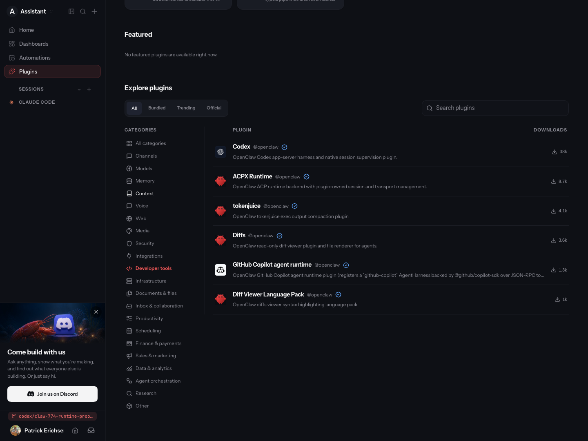
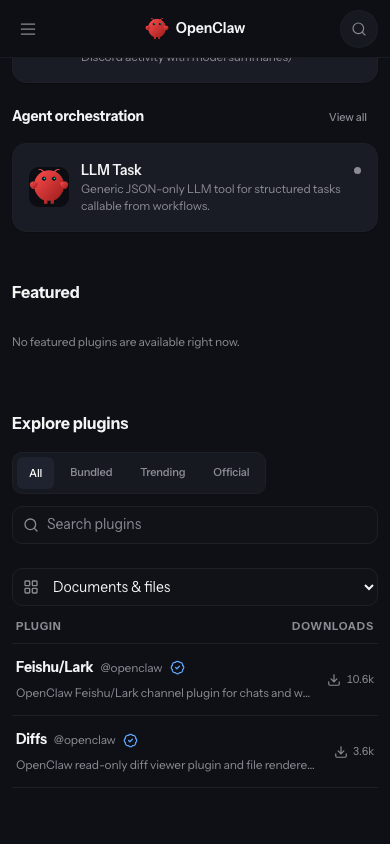
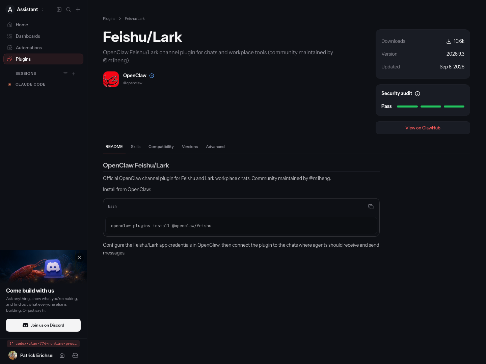
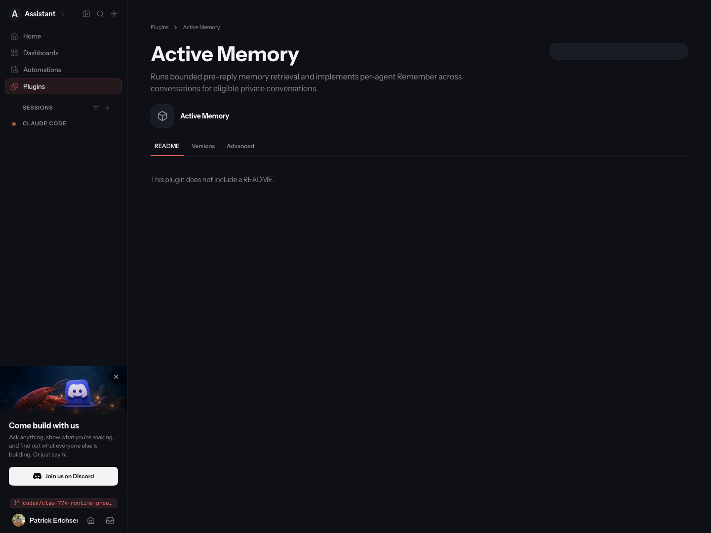

# Production sample: OpenClaw category and routing proof

The built Gateway and real Control UI agree with the local ClawHub snapshot for **all 100 catalog entries**, the complete **21-category definition list**, and **all 152 bundled runtime category assignments**. All **150 packaged manifests** match source. Two private QA plugins are intentionally not packaged; three source manifests lack package names and are excluded from the 149-entry registry inventory.

This is partial full-stack proof: the 40 bundled assignments were applied locally; **59 model-dependent classifications remain pending credential access**, and one package without bounded manifest evidence was skipped. The [ClawHub rehearsal](https://github.com/openclaw/clawhub/pull/3637#issuecomment-5595164117) includes sample provenance, the complete 40-row category diff, latest-only checks, real migration dry run/apply, exact rollback, fresh-preview rerun, and settled before/after filter screenshots. Nothing was changed in production.

## Running system

- Registry: disposable local Convex, cloud `http://127.0.0.1:3320`, HTTP `http://127.0.0.1:3321`.
- Control UI: isolated OCM Gateway `http://127.0.0.1:21231/plugins`, configured to use that registry.
- Baseline: `5ee48626b8db9c97a443fc51c1edc631530c84a0`; final runtime: `c8960487ad31f42647c2f133ad3a78b8dbab054a`.
- Final build ID: `2026.9.3-c8960487ad31-2026-09-09T03-13-11.843Z`.
- Pinned source category inventory: `5ee48626b8db9c97a443fc51c1edc631530c84a0`.
- Chromium, dark theme, same isolated preview user. Desktop 1440×1080; mobile 390×844. Images show the actual app after the data loaded.

## Routing regression found by the real browser

The original stack returned **404 for `/plugins`**, even though the application links there. After fixing the root route, generated plugin detail URLs still returned 404 on reload. Both are now recognized as Control UI document routes, using the existing discovery-identity parser. JSON requests, writes, arbitrary plugin paths, and deeper plugin HTTP paths retain their previous handling.

The paired catalog screenshots compare the same root route before and after the routing fix. The baseline is an actual HTTP 404, not an empty category result. Additional screenshots below are final-state evidence, not before/after comparisons.

Actual HTTP checks cover **15 method/path/Accept combinations**, all passing. Browser interaction clicked the real Feishu/Lark catalog card, opened its detail, and reloaded successfully with HTTP 200. The local Active Memory detail also loaded with HTTP 200. The detail-route pre-fix GET results were recorded at intermediate commit `ffbe00925f9d8d8113ed7e9d667b1de0e32c339e`, separately from the root-route baseline.

## Final-state screenshots

## Validation

- 100/100 catalog categories match the local ClawHub response, in order; no remote catalog error.
- 21/21 category definitions, including labels and icons, match across ClawHub and OpenClaw.
- 152/152 bundled runtime categories match source manifests; 149 named source entries match the pinned registry inventory; all 150 built manifests match source.
- 253 focused routing and discovery-identity tests pass; core TypeScript, typed lint, formatting, and autoreview pass.
- Full `pnpm build` passed for the root-route fix; the final detail-route commit passed fresh runtime/UI builds and the manifest audit above.
- Actual Gateway HTTP boundary checks: 15/15 pass. Real browser card navigation, detail reload, mobile category selection, and authenticated Gateway RPCs pass.

The safe machine-readable evidence is in `summary.json`. Raw registry records, authentication material, local device identities, and private user diagnostics are not published.
